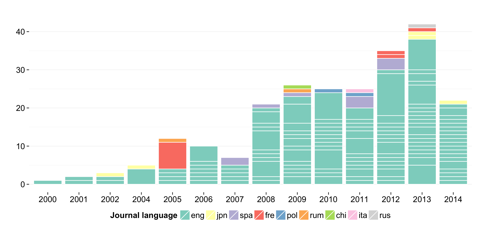

* `pubmed_names` — get counts of unique authors (might still choke)
* `pubmed_edges` — get undirected, weighted edge lists of coauthors

# DEMO

The main workhorse is the `pubmed_edges` function, which produces undirected, weighted edge lists of coauthors for each batch of PubMed XML records. The other product of the function is a CSV file that contains metadata for each article that has coauthors:

* `pmid` — the PMID of the article
* `journal` — abbreviated capitalized journal title, without punctuation
* `language` — article language (three-letter code)
* `keywords` — the keywords of the article (many articles have none)

Back to the FCTC example from the `PubMedXML` functions:

```{S}
require(ggplot2)
pubmed_edges("pubmed_fctc")

# read article information
d = read.csv('pubmed_fctc.csv')
d$uid = paste(d$journal, d$language, d$year)
d = as.data.frame(table(d$uid))
d = data.frame(journal = str_sub(d$Var1, 1, -10),
               language = str_sub(d$Var1, -8, -6),
                 year = str_sub(d$Var1, -4, -1),
                 count = d$Freq)

# order language by count
t = table(d$language)
t = names(t)[ order(t, decreasing = TRUE) ]
d$language = factor(d$language, levels = t)

# plot over publication year
qplot(data = d[ order(d$language), ], x = year, y = count, color = I("white"),
      fill = language,
      stat = "identity", geom = "bar") +
  scale_fill_brewer("Journal language", palette = "Set3", na.value = "grey") +
  labs(x = NULL, y = NULL) +
  theme(legend.position = "bottom")

# save example
ggsave("pubmed_fctc_lang.png", width = 12, height = 6)
```

